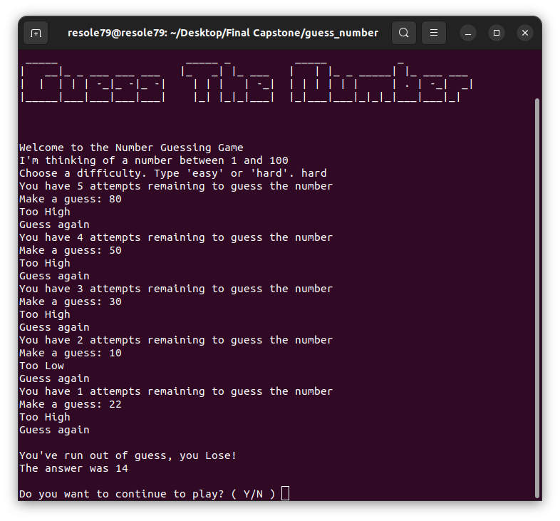

## Guess Number Game

Program for **Guess Number Game**

We have selected a random number between 1 and 100.     
See if you can guess it in 5 turns with hard level, 10 easy level.      
We'll tell you if your guess was too high or too low.      
       
###### It's a part of the **#100DaysOfCode** challenge by Angela Yu. ######


#### Prerequisites
You will need the following software to run the Guess Number Game:
 - [Python 3](https://www.python.org/downloads/)


#### Installation
To get started with the "Guess Number Game", follow these steps:

1. **Clone** the repository:

```sh
git clone https://github.com/resole79/guess_number.git
```

2. **Run** the **guess_number.py** file:

```sh
python3 guess_number.py
```     

#### *File Structure*

 - **guess_number.py**: Main program.
 - **art.py** : File contains the draws


#### **Usage**

```
 _____                    _____ _          _____           _           
|   __|_ _ ___ ___ ___   |_   _| |_ ___   |   | |_ _ _____| |_ ___ ___ 
|  |  | | | -_|_ -|_ -|    | | |   | -_|  | | | | | |     | . | -_|  _|
|_____|___|___|___|___|    |_| |_|_|___|  |_|___|___|_|_|_|___|___|_|  

         
```

**How program present**




## **Credit**

Author : Emilio Reforgiato (resole79)

##
<p align="right"><a href="https://www.linkedin.com/in/emilio-reforgiato/" target=”_blank” ></a></p>


